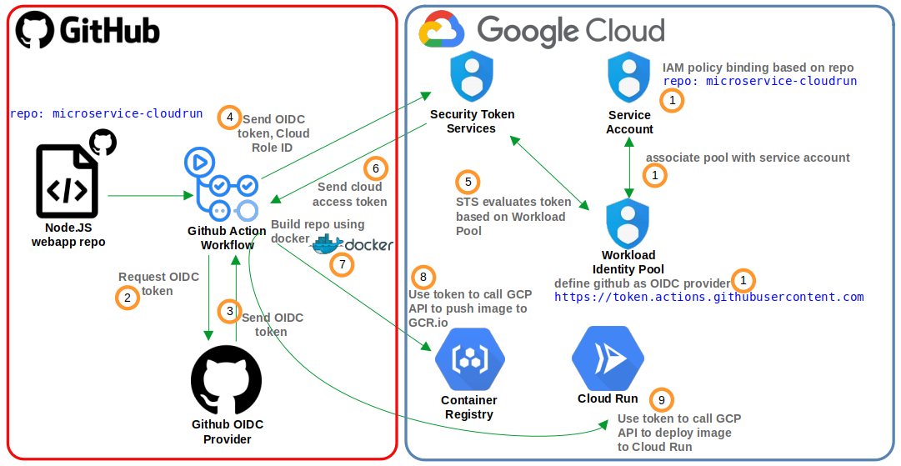
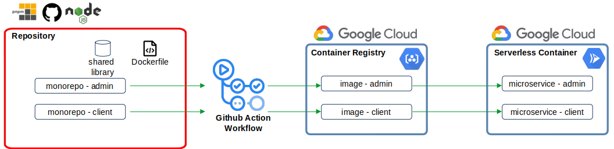

CI/CD pipeline to build monorepos using Docker and deploy as serverless container in Google Cloud Run with keyless authentication ( utilizing OIDC token and Workload Identity Federation )

This project consist of 2 sub project:-
1. Create CI CD pipeline to utilize keyless authentication by using OIDC token and Workload Identity Federation
2. Create CI CD pipeline to build monorepo (based on PNPM workspace) using Docker, push image to Google Container Registry and deploy as serverless container in Goog Cloud Run.

1. This pipeline is managed with Github Actions.
2. The web app is based on Node.JS and is built as container using docker.
3. The image is pushed to Google Container Registry via keyless authentication.
4. The keyless authentication is utilizing Github OIDC provider to setup trust with Google Workload Identity Federation.
5. Workload Identity Federation contains pool associated with Github OIDC provider and Service Account associated to this pool has IAM policy mapped to this repository.
6. OIDC token is sent to STS and it is evaluated with Workload Identity Pool.
7. STS returns access token to Github Actions.
8. Github Actions build the image using Docker and push to Container Register using the token provided by STS.
9. After that, the image is deployed to Cloud Run.

1. The repository consists of 2 monorepos sharing a shared library/package and the monorepos are built using PNPM workspace.
2. Each monorepo contains node.js web application which uses shared library as its dependency.
3. Each of the monorepo uses a function from the shared library.
4. The web app in both monorepo contains a button that will call a function and it will popup page alert displaying "Hello, $username User! You are an $username." when button is pressed.
5. These monorepos are built using single Dockerfile where dependencies for each monorepo are compiled together during the build process.
